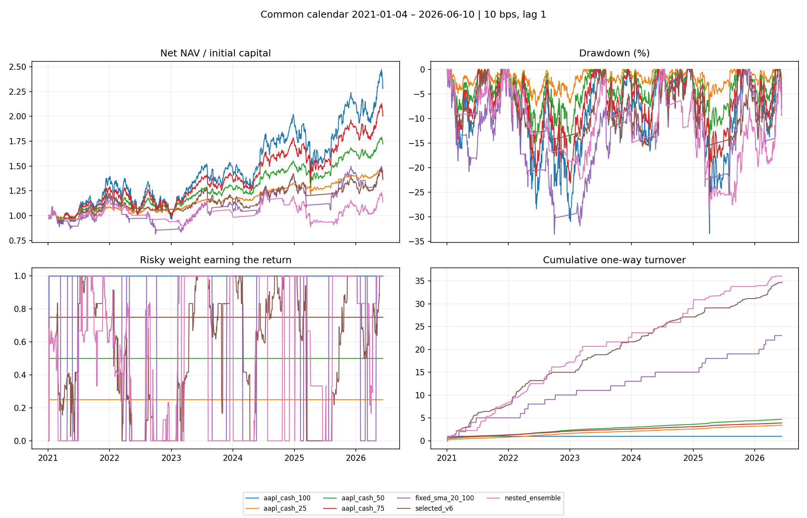
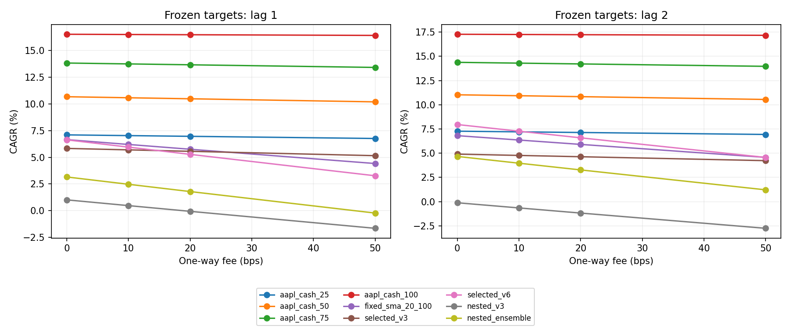
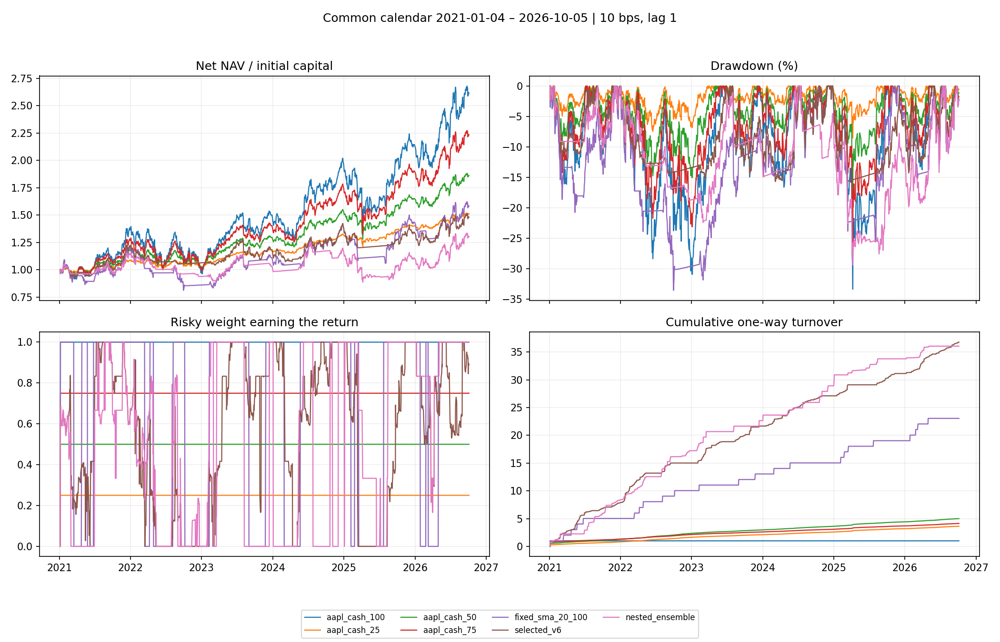
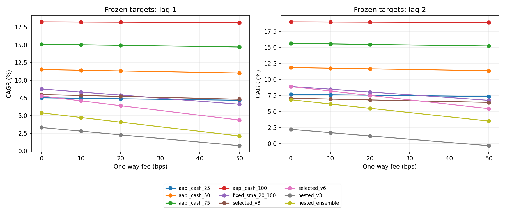

# AAPL: итог исследования

## Вопрос и вывод

Можно ли с помощью заранее ограниченного набора длинных трендовых сигналов и ежегодного выбора модели получать полезное участие в росте AAPL после расходов, с меньшим риском и преимуществом перед простыми альтернативами?

**На контрольном снимке преимущество сложных моделей не подтверждено.** Исправленный ежегодный ансамбль за 2018–2026 годы имеет CAGR 12,77%, Sharpe 0,59 и просадку 29,40%. На том же календаре постоянная доля 50% AAPL имеет CAGR 15,12%, Sharpe 0,84 и просадку 20,88%. На общем периоде с 2021 года разрыв ещё больше. Это достаточная причина завершить текущий поиск параметров и сохранить проект как проверенное учебное исследование. Результат не доказывает отсутствие любых возможных закономерностей в AAPL.

Все значения ниже — результаты симуляции. CAGR ежегодно нормируется по 252 предоставленным торговым сессиям; Sharpe вычитает ежедневную доходность денежного прокси BIL. Поэтому положительная абсолютная доходность может сочетаться с отрицательным Sharpe.

## Как проект дошёл до этой точки

Первоначальная стратегия SMA 20/100 выросла в исследование гистерезиса, распределения капитала, защитных фильтров, пяти дополнительных семейств сигналов, ансамблей и надстроек над ними. До v0.5 выбор использовал тестовые результаты. Позже выбор перенесли в обучение, но июньские предварительные результаты всё ещё имели ошибки исполнения, прогрева индикаторов, комиссий, переноса портфеля между окнами и статистической интерпретации.

A1 исправил этот контракт. A2 проверил его независимыми примерами и настоящими селекторами. A3 повторил прежний поиск, начиная с неизменного старого снимка. Новые семейства, расширение сеток и выбор более выгодного тестового периода в закрытие проекта не входили. Архивные документы и старые `outputs/` сохранены для истории и не являются текущим результатом. [Проверки A2](accounting_checks.md), [контракт A1](../a1_methodology.md).

## Данные и проверка качества

Исторический снимок: Yahoo Finance, столбцы скорректированного закрытия AAPL, MSFT, NVDA, AMZN, META, GOOGL, SPY, QQQ, BIL; **2 876** сессий, 2015-01-02–2026-06-10. Его канонический SHA-256:

`ffdb3eb9ed8108e5995e62b471ceab40c61ea3c457102756242fad2b9cbb96cd`.

Обновлённый снимок получен отдельно 2026-10-05 в 21:04 UTC, после завершения исторического прогона и сверки архива. Он содержит **2 956** сессий по 2026-10-05 включительно, то есть 80 дополнительных сессий. SHA-256:

`87b0315bc31e916696d6261c6db8b66088653bc21343edb0e3223c87b318fea8`.

Старый снимок проверен на положительные конечные цены, пропуски, дубли и полноту сессий XNYS: пропущенных и лишних сессий нет. XNYS служит прокси общего календаря американских акций и ETF; раннее закрытие остаётся полноценным дневным баром. Календарь взят из `exchange_calendars` 4.13.2, а не из простого списка будних дней. Это проверка дат, не сертификация цен биржей. [Аудит](historical/data_audit.json), [календарная библиотека](https://github.com/gerrymanoim/exchange_calendars), [официальный календарь NYSE](https://www.nyse.com/trade/hours-calendars).

Apple начала торги после дробления 4:1 31 августа 2020 года. В старом скорректированном ряду доходность этого дня +3,39%, без искусственного падения около 75%. Это один контроль события; дивиденды и все корпоративные события каждого инструмента независимо не заверялись. Крупные реальные или ошибочные скачки автоматически не удалялись. [Сообщение Apple](https://www.apple.com/newsroom/2020/07/apple-reports-third-quarter-results/), [дивиденды Apple](https://investor.apple.com/dividend-history/default.aspx).

Оба снимка представляют историю, скорректированную поставщиком задним числом. В обновлённой выгрузке общий старый участок немного изменился: цены в основном умножены на почти постоянные коэффициенты, максимальная разница дневной доходности среди инструментов около 0,00000140, или 0,000140 процентного пункта. Это наблюдение о двух выгрузках; точную причину каждой корректировки мы не установили. [Сверка истории](historical_revisions.csv). Данные не являются point-in-time архивом. Современный небольшой набор известных инструментов также не представляет исторический инвестиционный универсум без смещения выживших.

## Исполнение, деньги и выбор модели

- Начальный капитал 10 000 условных долларов, весь в денежной части. Цена первого дня определяет старт; до неё доходность не зарабатывается.
- Решение после закрытия дня t исполняется на закрытии t+1. Новая доля начинает получать доходность следующего бара. Это условная исполнимость по цене закрытия, без гарантии исполнения реальной заявки.
- Односторонняя комиссия 10 bps от фактического оборота рискованных активов, оплаченная из капитала. Смена активов оплачивает обе стороны. Ребалансировка учитывает дрейф долей после движения цен.
- Денежная часть синтетически получает total-return доходность BIL. ETF BIL не покупается, спред и расходы его покупки не моделируются. Эту часть нельзя назвать гарантированной безрисковой ставкой.
- Нет плеча, коротких позиций, налогов, объёмных ограничений, рыночного воздействия и продажи последнего портфеля в конце периода. 20 и 50 bps — условные стресс-сценарии, не измеренные реальные расходы.
- Для сравнения с 2021 года все политики заново начинают в день первого закрытия 2021-01-04, а индикаторы используют предшествующую историю. Для отдельной полной истории вложенного выбора начало — 2018-01-02. Эти два счёта имеют разные стартовые даты и показаны отдельно.
- Постоянные доли 25%, 50%, 75% AAPL поддерживаются ежедневной ребалансировкой; остаток получает тот же денежный прокси. 100% AAPL — отдельная политика buy-and-hold с первоначальной комиссией и той же задержкой. Ценовая reference-кривая старых таблиц без расходов не заменяет эту исполнимую политику.
- Фиксированные выбранные v3/v6 обучены на 2015–2020 годах. Вложенный выбор использует три предыдущих года обучения, один год проверки и годовой шаг, сохраняя один портфель между окнами. При отсутствии допустимого ансамбля используется фиксированный SMA 20/100.

Сетки находятся в [исторической конфигурации](../../configs/closeout_historical.yaml). Изменены только конечная дата и явное число процессов; сигналы и критерии выбора остались прежними. Выбранная v3 стала SMA 50/200 с входом 2%, выходом −0,5%, без удержания/паузы. Выбранная v6 объединяет ATR trend 200/20/2, Donchian 252/50 и 52-week-high 252/0,95/0,85; надстройки — режим SMA 200 и масштабирование волатильности 20 дней к 20%. [Параметры и хеши решений](historical/target_manifest.json), [ежегодный выбор](historical/nested_ensemble_walk_forward.csv).

## Контрольный результат: общий период

2021-01-04–2026-06-10, 1 365 сессий; 10 bps, lag 1. «Доля» — средняя рискованная доля, фактически зарабатывающая доходность, а не необработанный сигнал. Проценты округлены только для чтения; исходные значения сохранены в [comparison.csv](historical/comparison.csv).

| Политика | CAGR | Sharpe | Просадка | Средняя доля |
| --- | ---: | ---: | ---: | ---: |
| 25% AAPL / 75% деньги | 7,03% | 0,571 | −8,53% | 24,96% |
| 50% AAPL / 50% деньги | 10,58% | 0,573 | −17,50% | 49,93% |
| 75% AAPL / 25% деньги | 13,75% | 0,576 | −25,76% | 74,89% |
| 100% AAPL | 16,51% | 0,579 | −33,36% | 99,85% |
| Фиксированный SMA 20/100 | 6,20% | 0,247 | −33,53% | 63,44% |
| Выбранная v3 | 5,70% | 0,221 | −33,36% | 71,79% |
| Выбранная v6 | 5,95% | 0,257 | −15,67% | 54,60% |
| Ежегодная v3 | 0,47% | −0,040 | −33,33% | 68,28% |
| Ежегодный ансамбль | 2,47% | 0,037 | −29,40% | 47,21% |

Сравнение только с 100% AAPL могло бы преувеличить пользу защиты. У v6 годовая волатильность 14,61%, у постоянной доли 50% — 13,79%, поэтому это содержательная простая альтернатива близкого риска. v6 уменьшила просадку относительно этой альтернативы на 1,83 процентного пункта, но потеряла 4,63 пункта CAGR. Вложенный ансамбль при средней доле меньше 50% имеет худшие доходность, Sharpe и просадку. Разная средняя доля сама по себе не означает равенство риска: важен ещё момент участия.

## Полная история вложенного выбора

2018-01-02–2026-06-10, 2 121 сессия; тот же денежный контракт, комиссия и начальный капитал. [Полная сопоставимая таблица](historical/full_nested_comparison.csv).

| Политика | CAGR | Sharpe | Просадка |
| --- | ---: | ---: | ---: |
| 50% AAPL / 50% деньги | 15,12% | 0,837 | −20,88% |
| 100% AAPL | 26,51% | 0,842 | −38,52% |
| Ежегодная v3 | 8,38% | 0,359 | −40,10% |
| Ежегодный ансамбль | 12,77% | 0,591 | −29,40% |

Хорошие ранние годы улучшают полный результат ансамбля. Они не отменяют слабый общий результат после 2021 года. Обе области показаны по заранее согласованному плану, а не выбраны по прибыльности.

## Что изменилось относительно архива

| Результат | Архив | Исправлено |
| --- | ---: | ---: |
| SMA 20/100, тестовый CAGR | 7,75% | 6,20% |
| v3, тестовый Sharpe | 0,201 | 0,221 |
| v6, тестовый Sharpe | 0,192 | 0,257 |
| Ежегодный ансамбль, полный CAGR | 11,93% | 12,77% |
| Ежегодный ансамбль, полный Sharpe | 1,196 | 0,591 |
| Ежегодный ансамбль, полная просадка | −14,23% | −29,40% |

Цена входа смещена к следующему закрытию, затраты финансируются правильно, окно проверки прогревает индикаторы, портфель перестал обнуляться ежегодно, а Sharpe вычитает фактическую ежедневную денежную доходность. Исправление обучающих оценок меняет и выбранные параметры: архивная v3 была 5/50, новая 50/200; состав v6 тоже изменился. Поэтому это совокупное изменение методики и выбора, не чистая оценка эффекта одной комиссии. Разница CAGR и Sharpe может двигаться в разные стороны. Точная доля каждого исправления в общем изменении не оценивалась. [Полная сверка с названиями моделей](archive_comparison.csv).

## Расходы, задержка и разные годы

Четыре комиссии 0/10/20/50 bps и две задержки 1/2 повторяют **одни и те же сохранённые решения**. Нового обучения под сценарий нет. [Все 72 сценария](historical/sensitivity.csv).

При lag 1 CAGR v6 снижается с 6,63% без расходов до 5,95% при 10 bps, 5,27% при 20 bps и 3,27% при 50 bps. Ежегодный ансамбль: 3,16%, 2,47%, 1,79%, −0,23% соответственно. При комиссии 20 bps его Sharpe становится −0,006. У 50% AAPL CAGR при тех же комиссиях 10,68%, 10,58%, 10,48%, 10,20%.

Дополнительная задержка случайно улучшает ряд доходностей на этом участке, включая buy-and-hold, за счёт иных первых дней участия. Например, у ансамбля при 10 bps CAGR становится 3,96%, но просадка ухудшается до 31,69%. Менять основную задержку на более выгодную по этой проверке нельзя.

В 2022 году фактическая доходность 100% AAPL была −26,40%, 50% AAPL −12,33%, фиксированной v6 −11,92%, ежегодного ансамбля −17,31%, ежегодной v3 −26,26%. Эффект защиты зависел от конкретной модели и года. [Результаты каждого календарного года](historical/period_results.csv) извлечены из непрерывного счёта; первые дневные доходности года сохранены, нового входа 1 января нет. В неполном 2026 году `total_return` — фактическая доходность участка, `cagr` — её годовая нормировка, не уже заработанная годовая доходность.

## Неопределённость и альфа

На общем периоде 2021+ 5–95% блоковый bootstrap интервал Sharpe ансамбля составляет −0,711…+0,750; доля отрицательных повторов 45,9%. Для v6 интервал −0,469…+0,964, для 50% AAPL −0,086…+1,222. Использовано 1 000 круговых повторов, блок 21 сессия, seed 42, совместное переупорядочивание доходности и денежной reference. [Условные интервалы](historical/bootstrap_common.csv).

Полный ансамбль 2018+ имеет условный интервал Sharpe +0,010…+1,197. Это слабый нижний край и результат другой области наблюдения. Bootstrap переигрывает готовые доходности, не весь выбор моделей, и не учитывает все ручные эксперименты исследователя. «Доля отрицательных повторов» не является вероятностью существования альфы или будущего убытка.

DSR и timing permutation сохранены как диагностика: они учитывают только переданные кандидаты и упрощения конкретной реализации. История ручного поиска неполна, сетки коррелируют. PBO около 0,506 относится к 200 кандидатам из сетки гистерезиса 2 052 вариантов, 12 блокам и 924 комбинациям; это не вероятность переобучения всего конвейера v6. [Статистика](historical/significance_results.csv), [область PBO](historical/pbo_results.csv), [исходная работа о DSR](https://www.davidhbailey.com/dhbpapers/deflated-sharpe.pdf).

Sharpe выше нуля относительно BIL не отделяет рыночную экспозицию от прогнозирования. В этой работе не оценён полный факторный риск и не проведён независимый будущий эксперимент. Даже вложенный выбор не делает уже изучавшуюся историю нетронутой проверкой. Обновление данных добавляет наблюдения и изменяет старые корректировки; это также не гарантированный независимый holdout. Соответственно, статистически обоснованного заявления о найденной альфе здесь нет.

## Обновлённый прогон

Отдельный полный поиск завершён на обновлённом снимке. Общая область теперь 2021-01-04–2026-10-05, 1 445 сессий. Ни одна настройка не менялась для улучшения этого результата. [Сопоставимая таблица](updated/comparison.csv), [полный вложенный период](updated/full_nested_comparison.csv), [аудит обновлённого снимка](updated/data_audit.json).

| Политика | CAGR | Sharpe | Просадка |
| --- | ---: | ---: | ---: |
| 25% AAPL / 75% деньги | 7,46% | 0,622 | −8,53% |
| 50% AAPL / 50% деньги | 11,43% | 0,625 | −17,50% |
| 75% AAPL / 25% деньги | 15,04% | 0,628 | −25,76% |
| 100% AAPL | 18,25% | 0,631 | −33,36% |
| Фиксированный SMA 20/100 | 8,34% | 0,343 | −33,53% |
| Выбранная v3 | 7,85% | 0,308 | −33,36% |
| Выбранная v6 | 7,10% | 0,322 | −15,67% |
| Ежегодная v3 | 2,81% | 0,082 | −33,33% |
| Ежегодный ансамбль | 4,74% | 0,174 | −29,40% |

Полная история 2018–2026 улучшилась: у ансамбля CAGR 14,01%, Sharpe 0,635; у 50% AAPL — 15,52% и 0,859, при меньшей просадке 20,88%. На общей области bootstrap интервал Sharpe ансамбля −0,512…+0,826 по-прежнему пересекает ноль. Результат не меняет рекомендацию завершить текущий поиск. Изменения чисел включают новые 80 наблюдений и малые пересмотры прежних скорректированных цен; отдельный причинный эффект каждого источника не оценивался.

Полные [сценарии](updated/sensitivity.csv), [годы](updated/period_results.csv), [интервалы](updated/bootstrap_common.csv) и [ежегодные решения](updated/nested_ensemble_walk_forward.csv) сохранены отдельно. Это дополнительное наблюдение, не замена контрольного снимка и не повод объявить всю историю независимой проверкой.

## Завершение и следующий проект

Смысл завершения — оставить проверяемую цепочку от входных данных и правил до слабого либо отрицательного результата. Текущий проект полезен как учебный пример финансового учёта, причинности и опасности оптимизации. Продолжать наращивать его индикаторы ради красивого Sharpe экономически не оправдано по полученному сравнению.

Для следующего исследования сначала нужны экономическая гипотеза и причина, почему эффект может сохраняться после расходов; затем доступный исторический универсум, point-in-time правила, журнал всех попыток и простой базовый конкурент. Инженерные проверки учёта можно перенести. Оценку новой гипотезы стоит вести в отдельном репозитории и новом чате с кратким стартовым документом: так новые данные, решения и попытки останутся отделены от уже изученного AAPL периода.

## Воспроизведение и ограничения публикации

Пошаговые команды и границы воспроизводимости: [reproduction.md](reproduction.md). Подробные дневные журналы, снимки и CSV решений лежат локально в `outputs_closeout/`; в Git сохраняются компактные таблицы, рисунки, конфигурации и хеши. Чистая среда должна воспроизвести числа из сохранённых входов; новая загрузка Yahoo может не совпасть с исходным снимком.

Старые сгенерированные `outputs/` содержали сырые цены и исключены из отслеживаемого дерева этой версии, сохранившись локально. Предыдущая история Git по-прежнему содержит эти выгрузки; она не переписывалась. Лицензия библиотеки yfinance не предоставляет автоматически права на её рыночные данные. Разработчики указывают на исследовательское/учебное назначение и условия Yahoo, включая ограничение personal use. Права на распространение сырых цен здесь не установлены; снимки не включены в выпуск. [Документация yfinance и ссылки на условия поставщика](https://github.com/ranaroussi/yfinance). Точные результаты для нового пользователя требуют доступа к соответствующему снимку и локальным CSV решений, либо повторного полного поиска на таком снимке.

